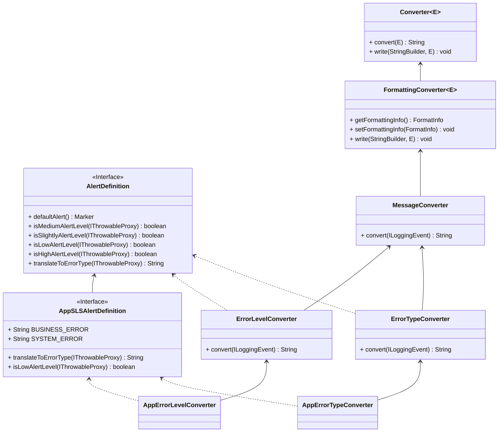

```mermaid
classDiagram
direction BT
class AlertDefinition {
<<Interface>>
  + defaultAlert() Marker
  + isMediumAlertLevel(IThrowableProxy) boolean
  + isSlightlyAlertLevel(IThrowableProxy) boolean
  + isLowAlertLevel(IThrowableProxy) boolean
  + isHighAlertLevel(IThrowableProxy) boolean
  + translateToErrorType(IThrowableProxy) String
}
class AppSLSAlertDefinition {
<<Interface>>
  + String BUSINESS_ERROR
  + String SYSTEM_ERROR
  + translateToErrorType(IThrowableProxy) String
  + isLowAlertLevel(IThrowableProxy) boolean
}
class Converter~E~ {
  + convert(E) String
  + write(StringBuilder, E) void
}
class FormattingConverter~E~ {
  + getFormattingInfo() FormatInfo
  + setFormattingInfo(FormatInfo) void
  + write(StringBuilder, E) void
}
class MessageConverter {
  + convert(ILoggingEvent) String
}

class AppErrorLevelConverter
class AppErrorTypeConverter
class ErrorLevelConverter {
  + convert(ILoggingEvent) String
}
class ErrorTypeConverter {
  + convert(ILoggingEvent) String
}

AppErrorLevelConverter  ..>  AppSLSAlertDefinition
AppErrorLevelConverter  -->  ErrorLevelConverter
AppErrorTypeConverter  ..>  AppSLSAlertDefinition
AppErrorTypeConverter  -->  ErrorTypeConverter
AppSLSAlertDefinition  -->  AlertDefinition
ErrorLevelConverter  ..>  AlertDefinition
ErrorLevelConverter  -->  MessageConverter
ErrorTypeConverter  ..>  AlertDefinition
ErrorTypeConverter  -->  MessageConverter
FormattingConverter~E~  -->  Converter~E~
MessageConverter  -->  FormattingConverter~E~
```
